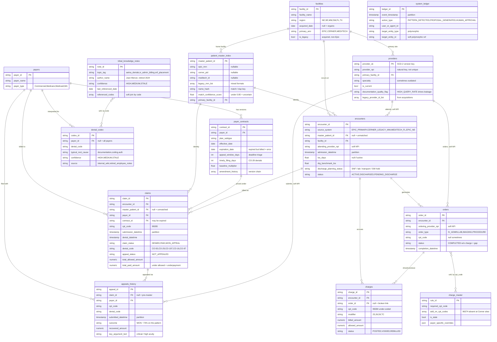

# Veridian Health — ER Diagram

Logical model for the ShareContext demo warehouse (`veridian_health`, **26 tables** — 14 core RCM + 12 operational).
Curated key/business columns shown — full column set + comments live in
[`01_schema.sql`](01_schema.sql) (core) and [`02_schema_operational.sql`](02_schema_operational.sql) (operational).
The **core** diagram is below; the **operational expansion** subgraph is at the bottom.

**Reading it**
- Crow's-foot `||--o{` = one-to-many. Solid relationships = FKs declared in the DDL
  (all `NOT ENFORCED` — metadata only).
- `soft NPI` = join by `provider_npi`, no FK (providers is SCD-2, so its PK is the
  per-version surrogate `provider_sk`).
- `soft, by code` = `charge_master` / `tribal_knowledge_notes` match by CPT/denial
  code, not by key.
- `system_ledger` is an audit overlay — it references **any** entity polymorphically
  via `target_entity_type` + `target_entity_id`, so it has no FK by design.

**⚠️ FKs the DATA intentionally violates (this is the reconciliation story, not a bug):**
- `encounters.master_patient_id` / `claims.master_patient_id` can be **NULL** → unmatched EMPI.
- `charges.order_id` can be **NULL** → broken order→charge linkage.
- `claims.contract_id` can point to an **expired** contract version → billing error.

---

### Where the 12 demo patterns live (hotspots)

| Pattern | Primary tables |
|---|---|
| A · Charge capture | `orders` → `charges` (gap) · `charge_master` · `facilities` · `tribal_knowledge_notes` |
| B · Denied claims | `claims` · `appeals_history` · `denial_codex` · `tribal_knowledge_notes` |
| C · LOS | `encounters` (active IP) · `tribal_knowledge_notes` |
| D · Underpayment | `claims` (paid vs allowed) · `payer_contracts` (amendment) |
| E · Expired-contract | `claims.contract_id` · `payer_contracts.expiration_date` |
| F · Timely-filing triage | `claims.denial_datetime` + `payer_contracts.appeal_window_days` |
| G · EMPI duplicates | `patient_master_index` (name_hash collisions) · `encounters` |
| H · Dup charges/orders | `orders` · `charges` |
| I · Cross-system fragmentation | `encounters` · `patient_master_index` (across source_system) |
| J · Denial prevention | `providers.documentation_quality_flag` · `claims` · `denial_codex` |
| K · Knowledge-decay | `denial_codex` · `tribal_knowledge_notes` · `appeals_history` |
| L · Denial benchmarking | `claims` · `facilities` · `payers` |

---

## Operational expansion (12 new raw tables → 26 total)

Raw source tables broadening the warehouse beyond revenue cycle — defined in
[`02_schema_operational.sql`](02_schema_operational.sql). Anchor entities
(`facilities` / `patient_master_index` / `encounters` / `orders` / `payers` /
`providers`) are shown as **stubs** here; their full definition is in the core
diagram above.

```mermaid
erDiagram
    facilities { string facility_id PK }
    patient_master_index { string master_patient_id PK }
    providers { string provider_npi "soft natural key" }
    encounters { string encounter_id PK }
    orders { string order_id PK }
    payers { string payer_id PK }

    departments {
        string department_id PK
        string facility_id FK
        string department_type "ED,ICU,MED_SURG,LAB"
        string cost_center_code "format varies by ERP"
        string service_line
    }
    lab_results {
        string lab_result_id PK
        string encounter_id FK "null = outreach"
        string order_id FK "null = broken link"
        string loinc_code
        string abnormal_flag "N,H,L,CRITICAL"
        string result_status "PRELIMINARY blocks discharge"
    }
    bed_management {
        string bed_event_id PK
        string encounter_id FK
        string facility_id FK
        string bed_type "ED,ICU,STEPDOWN"
        float  ed_boarding_hours
        bool   is_blocked "discharge-ready, awaiting placement"
    }
    care_management {
        string cm_task_id PK
        string encounter_id FK
        string task_type "SNF_PLACEMENT_REQUEST"
        string task_status "NOT_STARTED = the gap"
        string barrier_type "AWAITING_SNF_BED"
    }
    prior_authorizations {
        string auth_id PK
        string encounter_id FK
        string payer_id FK
        string cpt_code
        string auth_status "NOT_OBTAINED = CO-197 risk"
    }
    referrals {
        string referral_id PK
        string master_patient_id FK
        string referred_to_facility_id FK "null = external"
        string referred_to_specialty
        bool   is_in_network "false = leakage"
        string status "SENT,LOST,EXPIRED"
    }
    appointments_scheduling {
        string    appointment_id PK
        string    facility_id FK
        string    referral_id FK
        string    linked_encounter_id FK "null = not seen"
        string    status "NO_SHOW,COMPLETED"
        timestamp scheduled_datetime
    }
    cdi_queries {
        string  query_id PK
        string  encounter_id FK
        string  provider_npi "soft NPI"
        string  query_status "NO_RESPONSE,DISAGREED"
        string  drg_impact "CC_ADDED,MCC_ADDED"
        numeric financial_impact
    }
    price_transparency_rates {
        string  rate_id PK
        string  facility_id FK
        string  payer_id FK "null = gross/cash"
        string  code
        string  rate_type "GROSS,CASH,NEGOTIATED"
        numeric negotiated_rate "wide variance"
    }
    workforce_shifts {
        string shift_id PK
        string facility_id FK
        string department_id FK
        string associate_role "RN,CNA,RT"
        bool   is_agency "premium cost"
        float  overtime_hours
        int    patient_census "for ratios"
    }
    supply_chain_transactions {
        string  supply_txn_id PK
        string  facility_id FK
        string  encounter_id FK "null = stock receipt"
        string  item_category "IMPLANT,SUPPLY"
        numeric unit_cost "varies by facility"
        bool    is_off_contract "GPO leakage"
    }
    quality_safety_events {
        string event_id PK
        string encounter_id FK
        string facility_id FK
        string event_type "FALL,HAI,READMISSION_30D"
        string severity "NO_HARM to DEATH"
        bool   is_preventable "null = unreviewed"
    }

    facilities           ||--o{ departments               : "has units"
    facilities           ||--o{ workforce_shifts          : "staffed at"
    departments          ||--o{ workforce_shifts          : "staffs"
    encounters           ||--o{ lab_results               : "results"
    orders               ||--o{ lab_results               : "produces"
    patient_master_index ||--o{ lab_results               : "identity"
    encounters           ||--o{ bed_management            : "occupies"
    facilities           ||--o{ bed_management            : "beds at"
    encounters           ||--o{ care_management           : "managed by"
    encounters           ||--o{ prior_authorizations      : "needs auth"
    payers               ||--o{ prior_authorizations      : "authorizes"
    patient_master_index ||--o{ referrals                 : "referred"
    referrals            ||--o{ appointments_scheduling   : "booked as"
    facilities           ||--o{ appointments_scheduling   : "scheduled at"
    appointments_scheduling ||--o| encounters             : "becomes (soft)"
    encounters           ||--o{ cdi_queries               : "queried"
    providers            ||--o{ cdi_queries               : "queried, soft NPI"
    providers            ||--o{ workforce_shifts          : "works, soft NPI"
    facilities           ||--o{ price_transparency_rates  : "publishes"
    payers               ||--o{ price_transparency_rates  : "negotiated"
    facilities           ||--o{ supply_chain_transactions : "consumes"
    encounters           ||--o{ supply_chain_transactions : "issued to case"
    encounters           ||--o{ quality_safety_events     : "event in"
    facilities           ||--o{ quality_safety_events     : "occurs at"
```

**New surface these unlock** (metric tables, built later, read from these raw tables):
- `lab_results` + `bed_management` + `care_management` → deepen **LOS** (awaiting-lab, ED boarding, the missing SNF request).
- `prior_authorizations` + `cdi_queries` → deepen **denial prevention** (no-auth → CO-197; `HIGH_QUERY_RATE` providers).
- `referrals` + `appointments_scheduling` → network leakage, no-show / access.
- `price_transparency_rates` → price variance / no-surprises.
- `workforce_shifts` → labor cost, agency spend, nurse-to-patient ratios (#1 expense).
- `supply_chain_transactions` → implant/supply cost variance (#2 expense).
- `quality_safety_events` → HAC / 30-day-readmission penalty exposure.
