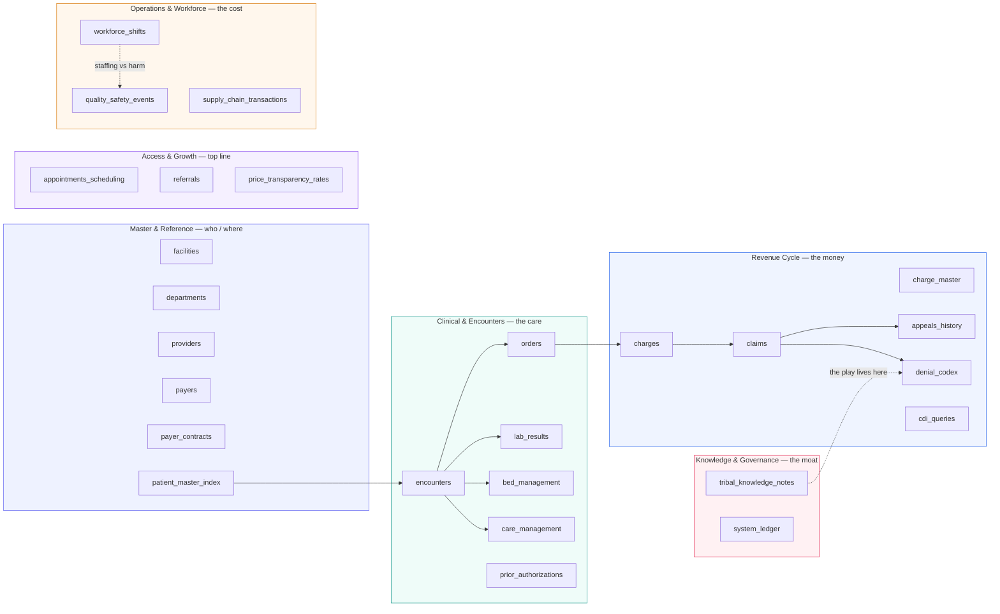

# Veridian Health — Synthetic Data Model (block diagram)

A business-readable view of the 26 tables grouped by domain. For a polished,
screenshot-ready version open **[block_diagram.html](block_diagram.html)**; the
attribute-level ER diagram is in **[ER_diagram.md](ER_diagram.md)**.

**26 tables · ~50M rows · 2020–2026 · 3 source EHRs (Epic / Cerner / Meditech) · 10 hospitals · 36 payers · no real PHI**

**Why it's a demo, not a spreadsheet:** the data is *messy by design* — multi-source IDs
from decades of acquisitions, EMPI duplicates, broken order→charge links, claims billed on
expired contracts, and the institutional knowledge that recovers the money living in a
**retired employee's notes**. The planted "aha" patterns ($1.4M denials, $890K charge gap,
$360K underpayment, 23 stuck inpatients) sit hidden in ~50M rows — surfaced only by reasoning
*across* these domains, which is the ShareContext story.
