# Veridian IT / Technology (CIO) — ER Diagram

Attribute-level model for the CIO subject area: the **10 raw `veridian_health.it_*` tables**
and the **13 `veridian_metrics` aggregate tables** they roll up into. Curated key/business
columns are shown — the full column set + comments live in
[`veridian_it/00_schema_it.sql`](../veridian_it/00_schema_it.sql) (raw) and in the rollup DDL
under [`part1/`](part1) + [`part2/`](part2) (aggregate). The block-level data flow is in
[`block_diagram.md`](block_diagram.md); the build/run brief is in [`HANDOFF.md`](HANDOFF.md).

**Reading it**
- Crow's-foot `||--o{` = one-to-many. Solid relationships = FKs declared in the raw DDL
  (all `NOT ENFORCED` — catalog metadata only).
- `soft NPI` = join by `provider_npi` (the natural key), no FK — `providers` is SCD-2, so its
  PK is the per-version surrogate `provider_sk`.
- The IT layer conforms to the **shared spine**: `facilities(facility_id)`,
  `departments(department_id)`, `providers(provider_npi)` — so IT rolls up the same way the
  clinical/financial metrics do. Those three are shown as **stubs** (defined in the base
  `veridian_health` schema, see [`veridian_health/ER_diagram.md`](../veridian_health/ER_diagram.md)).
- Internal IT keys: `system_id`, `vendor_id`, `asset_id`, `change_id`.

**⚠️ Keys the DATA intentionally leaves NULL (this is the M&A / enterprise-scope story, not a bug):**
- `it_change_requests.facility_id` / `it_cost_ledger.facility_id` / `it_incidents.facility_id`
  can be **NULL** → enterprise-wide / system-scoped, not site-attributed. Change/DORA measures
  therefore land on `facility_id = NULL` rows in `fact_it_servicedesk_month` (NULL-safe join).
- `it_systems.owning_facility_id` **NULL** = enterprise-wide system (not site-local).
- `it_systems.end_of_life_date` **NULL** = still supported; past-EOL = tech-debt / security risk.
- Repeated `it_systems.capability` across systems (one per acquired EMR heritage) **is** the
  redundancy / rationalization finding, not a duplicate-key error.

---

## 1 · RAW — `veridian_health.it_*` (10 source tables)

```mermaid
erDiagram
    facilities  { string facility_id PK }
    departments { string department_id PK }
    providers   { string provider_npi "soft natural key (PK is provider_sk)" }

    it_vendors {
        string  vendor_id PK
        string  vendor_name
        string  category "EHR,PACS,ERP,SECURITY,CLOUD,AI,..."
        bool    is_strategic "board-visible spend"
        date    msa_renewal_date "drives renewal worklist"
        numeric annual_spend
    }
    it_systems {
        string  system_id PK
        string  vendor_id FK
        string  system_name
        string  category "EHR,PACS,LAB,ERP,..."
        string  capability "repeats = redundancy target"
        string  criticality "TIER1_LIFE_SAFETY..TIER4"
        string  hosting "ON_PREM,CLOUD_AWS,CLOUD_AZURE,SAAS"
        string  emr_affinity "EPIC,CERNER,MEDITECH,NONE"
        string  owning_facility_id FK "null = enterprise-wide"
        date    go_live_date
        date    end_of_life_date "null = supported; past = debt"
        numeric annual_cost
    }
    it_assets {
        string asset_id PK
        string asset_type "SERVER,WORKSTATION,MEDICAL_DEVICE,..."
        string facility_id FK
        string department_id FK
        string system_id FK
        string vendor_id FK
        string os_family
        string os_version "legacy skews old"
        bool   is_end_of_life
        date   last_patched_date "stale at legacy sites"
    }
    it_change_requests {
        string    change_id PK
        string    system_id FK
        string    facility_id FK "null = enterprise-wide"
        string    change_type "NORMAL,STANDARD,EMERGENCY"
        timestamp scheduled_at
        timestamp implemented_at "null = not yet implemented"
        string    status "SUCCESS,FAILED,ROLLED_BACK"
        bool      caused_incident
    }
    it_incidents {
        string    incident_id PK
        string    system_id FK
        string    facility_id FK "null = enterprise-wide outage"
        string    department_id FK
        string    change_id FK "set when root_cause=CHANGE"
        string    severity "SEV1..SEV4"
        string    category "OUTAGE,DEGRADATION,SECURITY,..."
        timestamp opened_at "partition"
        timestamp resolved_at "null = still open"
        int       duration_minutes "MTTR input"
        bool      is_clinical_downtime
        string    root_cause "CHANGE,HARDWARE,NETWORK,CYBER,..."
    }
    it_vulnerabilities {
        string finding_id PK
        string asset_id FK
        string system_id FK
        string facility_id FK "denormalized for rollups"
        string cve
        string severity "CRITICAL,HIGH,MEDIUM,LOW"
        date   detected_date
        date   patched_date "null = still open"
        int    days_open
        bool   sla_breached "CRITICAL=7d, HIGH=30d"
    }
    it_cost_ledger {
        string  cost_id PK
        date    period "month bucket"
        string  system_id FK
        string  vendor_id FK
        string  facility_id FK "null = enterprise"
        string  cost_category "LICENSE,CLOUD,LABOR,HARDWARE,SUPPORT,TELECOM"
        numeric amount
        float   cloud_idle_pct "CLOUD lines only = waste"
    }
    service_desk_tickets {
        string    ticket_id PK
        string    system_id FK
        string    facility_id FK
        string    department_id FK
        string    associate_id "soft -> workforce_shifts"
        string    category "ACCESS,HARDWARE,EHR,..."
        string    channel "PHONE,PORTAL,SELF_SERVICE,WALKUP"
        timestamp opened_at "partition"
        timestamp resolved_at "null = open"
        int       resolution_minutes
        bool      is_self_service "deflection"
        bool      reopened "quality signal"
    }
    clinician_ehr_usage {
        string usage_id PK
        string provider_npi "soft NPI"
        string facility_id FK
        string department_id FK
        string system_id FK "the EHR app"
        date   period "month bucket"
        int    total_ehr_minutes
        int    after_hours_minutes "pajama time / burnout"
        int    inbasket_messages
        float  avg_login_seconds
    }
    ai_tool_usage {
        string usage_id PK
        string tool_name "AMBIENT_SCRIBE,RCM_AUTOMATION,..."
        string vendor_id FK
        string provider_npi "soft NPI"
        string facility_id FK
        string department_id FK
        date   period "month bucket"
        int    sessions "0 before adoption"
        int    minutes_saved
        bool   is_governed
    }

    it_vendors  ||--o{ it_systems           : "publishes"
    it_vendors  ||--o{ it_assets            : "hw/os vendor"
    it_vendors  ||--o{ it_cost_ledger       : "paid"
    it_vendors  ||--o{ ai_tool_usage        : "ai vendor"
    it_systems  ||--o{ it_assets            : "runs on"
    it_systems  ||--o{ it_change_requests   : "changed"
    it_systems  ||--o{ it_incidents         : "affected"
    it_systems  ||--o{ it_vulnerabilities   : "affected (soft)"
    it_systems  ||--o{ it_cost_ledger       : "attributed"
    it_systems  ||--o{ service_desk_tickets : "about"
    it_systems  ||--o{ clinician_ehr_usage  : "EHR app"
    it_assets   ||--o{ it_vulnerabilities   : "has findings"
    it_change_requests ||--o{ it_incidents  : "causes (root=CHANGE)"

    facilities  ||--o{ it_systems           : "owns (null=ent)"
    facilities  ||--o{ it_assets            : "located at"
    facilities  ||--o{ it_change_requests   : "scope (null=ent)"
    facilities  ||--o{ it_incidents         : "affects (null=ent)"
    facilities  ||--o{ it_vulnerabilities   : "at"
    facilities  ||--o{ it_cost_ledger       : "scope (null=ent)"
    facilities  ||--o{ service_desk_tickets : "at"
    facilities  ||--o{ clinician_ehr_usage  : "at"
    facilities  ||--o{ ai_tool_usage        : "at"
    departments ||--o{ it_assets            : "in"
    departments ||--o{ it_incidents         : "affects"
    departments ||--o{ service_desk_tickets : "in"
    departments ||--o{ clinician_ehr_usage  : "in"
    departments ||--o{ ai_tool_usage        : "in"
    providers   ||--o{ clinician_ehr_usage  : "uses, soft NPI"
    providers   ||--o{ ai_tool_usage        : "adopts, soft NPI"
```

---

## 2 · AGGREGATE — `veridian_metrics` (13 CIO tables)

Built by the rollup DDL in [`part1/`](part1) (dims 18–19, exec 20, facts 21–25) and
[`part2/`](part2) (worklists 26–30). The conformed spine is the same `facilities` /
`departments` / `providers` from the base schema; aggregate tables also carry **derived**
keys (`facility_id`, `system_id`, `vendor_id`, `asset_id`) inherited from the raw grain.
`exec_it_kpi_month` reads the **aggregate layer only** (the five facts + `dim_it_system`) — it
never re-scans raw.

```mermaid
erDiagram
    facilities  { string facility_id PK }
    departments { string department_id PK }

    dim_it_system {
        string  system_id PK
        string  vendor_id FK
        string  system_name
        string  vendor_name
        string  capability
        string  criticality
        string  owning_facility_id FK
        date    end_of_life_date
        bool    is_eol
        string  eol_horizon_band "PAST_EOL,<=12M,<=24M,>24M,NONE"
        int     capability_redundancy_count
        bool    is_redundant "count>1"
        numeric run_cost_ttm "trailing 12M"
        string  run_cost_band ">5M,1-5M,<1M"
        int     incident_count_ttm
        int     sev1_count_ttm
        bool    is_tier1
        string  time_class "TOLERATE,INVEST,MIGRATE,ELIMINATE"
    }
    dim_it_asset {
        string asset_id PK
        string facility_id FK
        string department_id FK
        string system_id FK
        string vendor_id FK
        string asset_type
        string region "from facilities"
        bool   is_legacy "from facilities"
        string os_family
        bool   is_end_of_life
        date   last_patched_date
        int    days_since_patch
        string patch_currency_band "CURRENT,AGING,STALE,NEVER"
        int    open_findings
        int    open_critical_findings
        bool   refresh_due
    }
    exec_it_kpi_month {
        date    month PK "36 rows, 2023-06..2026-05"
        float   service_availability_pct
        int     major_incident_count
        float   mttr_minutes
        float   incident_sla_pct
        int     clinical_downtime_minutes
        float   change_success_rate
        float   change_failure_rate "DORA"
        float   change_emergency_pct
        float   change_lead_time_hours
        int     open_critical_vulns
        float   vuln_sla_breach_pct
        numeric it_spend_total
        float   run_cost_pct
        float   cloud_idle_pct
        float   service_desk_mttr_hours
        float   self_service_deflection_pct
        float   reopen_rate
        float   ehr_after_hours_pct
        int     ai_minutes_saved
        float   ai_adoption_pct
    }
    fact_it_incident_month {
        date   month PK "part of grain"
        string facility_id FK "null = enterprise"
        string system_id FK
        int    incident_count
        int    sev1_count
        int    resolved_count
        numeric resolution_minutes_sum
        numeric downtime_minutes_sum
        numeric clinical_downtime_minutes
        int    change_caused_count
        int    within_sla_count
    }
    fact_it_security_month {
        date   month PK "part of grain"
        string facility_id FK "part of grain"
        string severity "part of grain"
        string facility_name
        string region
        int    new_findings
        int    remediated_findings
        int    remediation_days_sum
        int    within_sla_count
        int    sla_breached_count
        int    open_findings_eom
        int    open_critical_eom
        int    open_high_eom
        int    exposure_age_days_sum
    }
    fact_it_cost_month {
        date    period PK "part of grain"
        string  facility_id FK "part of grain (null=ent)"
        string  system_id FK "part of grain"
        string  cost_category "part of grain"
        string  vendor_id FK
        string  system_name
        string  vendor_name
        numeric total_cost
        numeric run_cost
        numeric grow_cost
        numeric cloud_cost
        numeric cloud_idle_cost "pre-multiplied"
        numeric license_cost
        int     cost_line_count
    }
    fact_it_servicedesk_month {
        date   month PK "part of grain"
        string facility_id FK "part of grain (null=change rows)"
        string facility_name
        string region
        int    ticket_count
        int    resolved_count
        numeric resolution_minutes_sum
        int    self_service_count
        int    first_contact_count
        int    reopened_count
        int    change_total "DORA"
        int    change_success_count
        int    change_failed_count
        int    change_emergency_count
        int    change_lead_time_minutes_sum
    }
    fact_it_dex_month {
        date   period PK "part of grain"
        string facility_id FK "part of grain"
        string department_id FK "part of grain"
        int    total_ehr_minutes_sum
        int    after_hours_minutes_sum
        int    inbasket_messages_sum
        float  login_seconds_sum
        int    login_observations
        int    active_providers
        int    ai_sessions_sum
        int    ai_minutes_saved_sum
        int    governed_session_count
        int    adopting_provider_count
    }
    worklist_open_critical_vulns {
        string  finding_id PK
        string  asset_id FK
        string  system_id FK
        string  facility_id FK
        string  cve
        string  severity "CRITICAL,HIGH"
        string  system_name
        string  region
        bool    is_legacy
        int     days_open
        date    sla_due_date
        bool    is_sla_breached
        bool    is_clinical_system
        int     exposure_score
    }
    worklist_eol_refresh {
        string  item_kind "ASSET | SYSTEM"
        string  item_id PK "asset_id or system_id"
        string  facility_id FK
        string  label
        string  region
        bool    is_legacy
        int     days_past_eol
        int     open_critical_findings
        numeric annual_run_cost "null for ASSET rows"
        bool    hosts_clinical_system
        int     refresh_priority_score
    }
    worklist_app_rationalization {
        string  system_id PK
        string  system_name
        string  capability
        string  vendor_name
        string  emr_affinity
        int     redundancy_count
        int     redundancy_rank "1 = survivor"
        numeric run_cost_ttm
        numeric consolidatable_spend "0 for survivor"
        string  time_class
        string  keep_or_retire "KEEP | RETIRE"
    }
    worklist_cloud_waste {
        string  cost_id PK
        string  system_id FK
        string  facility_id FK
        string  system_name
        string  vendor_name
        date    period
        numeric cloud_cost
        float   cloud_idle_pct ">= 0.20"
        numeric monthly_idle_amount
        numeric annualized_savings
        string  owner_facility FK
    }
    worklist_vendor_renewals {
        string  vendor_id PK
        string  vendor_name
        string  category
        bool    is_strategic
        date    msa_renewal_date "<= as_of + 180d"
        int     days_to_renewal
        numeric annual_spend
        numeric ttm_spend
        int     systems_under_vendor
        bool    is_sole_source "concentration proxy"
    }

    dim_it_system ||--o{ worklist_app_rationalization : "redundant systems"
    facilities    ||--o{ dim_it_system               : "owns (null=ent)"
    facilities    ||--o{ dim_it_asset                : "located at"
    facilities    ||--o{ fact_it_incident_month      : "grain (null=ent)"
    facilities    ||--o{ fact_it_security_month      : "grain"
    facilities    ||--o{ fact_it_cost_month          : "grain (null=ent)"
    facilities    ||--o{ fact_it_servicedesk_month   : "grain (null=change)"
    facilities    ||--o{ fact_it_dex_month           : "grain"
    facilities    ||--o{ worklist_open_critical_vulns: "at"
    facilities    ||--o{ worklist_eol_refresh        : "at"
    facilities    ||--o{ worklist_cloud_waste        : "at"
    departments   ||--o{ dim_it_asset                : "in"
    departments   ||--o{ fact_it_dex_month           : "grain"
    dim_it_system ||--o{ dim_it_asset                : "hosts (soft)"
    dim_it_system ||--o{ fact_it_incident_month      : "system (soft)"
    dim_it_system ||--o{ fact_it_cost_month          : "system (soft)"
    dim_it_system ||--o{ worklist_open_critical_vulns: "system (soft)"
    dim_it_system ||--o{ worklist_cloud_waste        : "system (soft)"
```

> Aggregate FKs are **soft** (no enforced constraints on the metric layer): `system_id`,
> `facility_id`, `department_id`, `asset_id`, `vendor_id` carry the same key values as the raw
> grain, so each metric/worklist joins back to `dim_it_system` / `dim_it_asset` and the
> conformed `facilities` / `departments` spine, but a key may be NULL where the raw grain was
> enterprise-scoped (see the NULL note above).

---

## 3 · Raw → aggregate lineage (which raw table feeds which aggregate)

| Aggregate table | Kind | Grain | Fed by (raw / agg sources) |
|---|---|---|---|
| `dim_it_system` | dim | system, as_of | `it_systems`, `it_vendors`, `it_cost_ledger` (TTM run cost), `it_incidents` (TTM reliability) |
| `dim_it_asset` | dim | asset, as_of | `it_assets`, `facilities` (region/is_legacy), `it_vulnerabilities` (open findings) |
| `fact_it_incident_month` | fact | month × facility × system | `it_incidents` |
| `fact_it_security_month` | fact | month × facility × severity | `it_vulnerabilities`, `facilities` |
| `fact_it_cost_month` | fact | period × facility × system × category | `it_cost_ledger`, `it_systems`, `it_vendors` |
| `fact_it_servicedesk_month` | fact | month × facility | `service_desk_tickets`, `it_change_requests`, `facilities` |
| `fact_it_dex_month` | fact | period × facility × department | `clinician_ehr_usage`, `ai_tool_usage` |
| `worklist_open_critical_vulns` | worklist | open CRITICAL/HIGH finding | `it_vulnerabilities`, `it_assets`, `it_systems`, `facilities` |
| `worklist_eol_refresh` | worklist | EOL/stale asset **or** past-EOL system | `it_assets`, `it_systems`, `it_vulnerabilities`, `facilities` |
| `worklist_app_rationalization` | worklist | redundant-capability system | `dim_it_system` (agg — builds after 18; `it_cost_ledger`/`it_vendors` folded in via the dim) |
| `worklist_cloud_waste` | worklist | high-idle CLOUD cost line | `it_cost_ledger`, `it_systems`, `it_vendors` |
| `worklist_vendor_renewals` | worklist | vendor with MSA renewal ≤180d | `it_vendors`, `it_systems`, `it_cost_ledger` |
| `exec_it_kpi_month` | exec | month (one row/month) | **agg layer only** — the five `fact_it_*_month` + `dim_it_system` (fleet size for availability denominator); no raw scan |

**Conformance:** every raw `it_*` table keys to the shared `facilities(facility_id)` /
`departments(department_id)` / `providers(provider_npi)` spine, so the aggregate layer rolls IT
metrics up the same dimensions as the clinical/financial metrics — letting `exec_it_kpi_month`
sit beside `exec_kpi_month` as a peer CIO scorecard.
