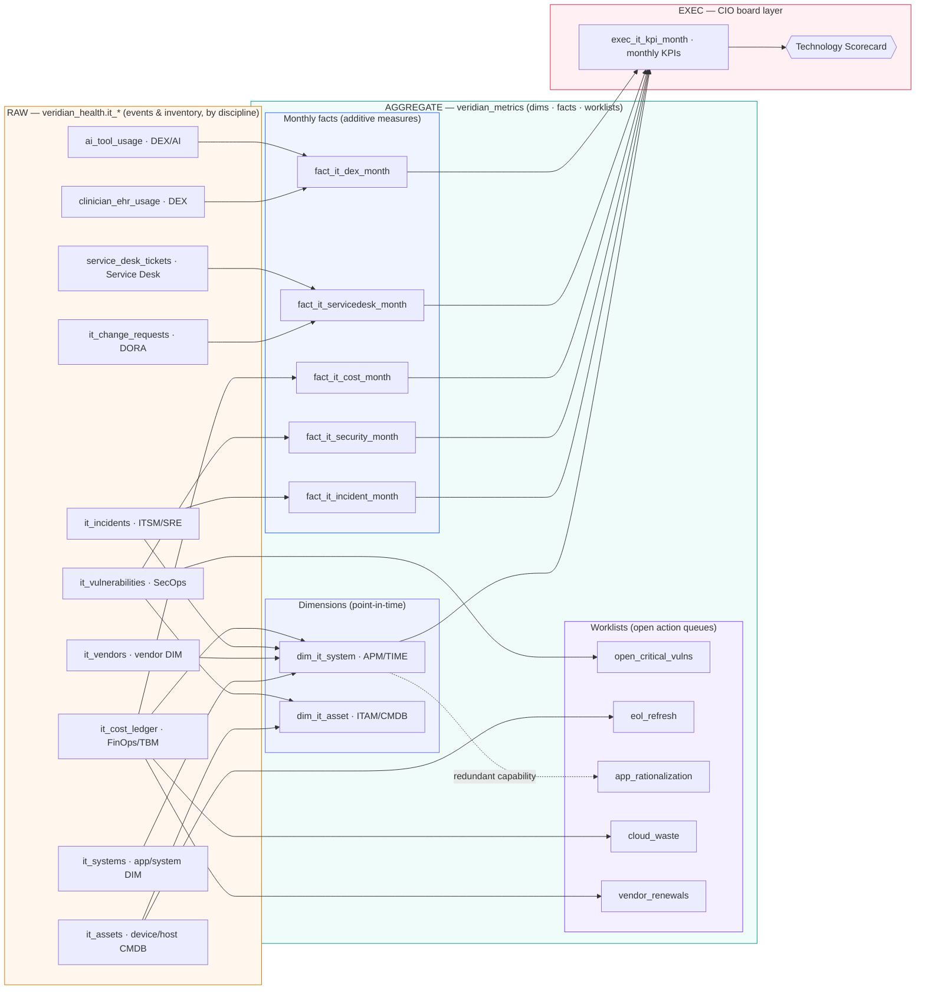

# Veridian IT / Technology (CIO) — Aggregate Layer (block diagram)

A business-readable view of how the **`veridian_health.it_*`** raw tables roll up
into the **`veridian_metrics`** CIO aggregate layer and finally into a single
board-ready **Technology Scorecard**. The attribute-level relationships are in
**[ER_diagram.md](ER_diagram.md)**; the build/run brief is in **[HANDOFF.md](HANDOFF.md)**.

**10 raw IT tables → 13 aggregate tables (2 dims · 5 facts · 5 worklists · 1 exec) · 36 months 2023‑06 … 2026‑05 · as_of 2026‑06‑04 · no GCP project hardcoded**

**Why it matters (CIO):** This layer turns a decade of acquisition-era IT sprawl —
ten event and inventory tables across nine management disciplines (ITSM/SRE, DORA,
SecOps, ITAM/CMDB, APM/TIME, FinOps/TBM, Service Desk, DEX, Vendor) — into one
governed scorecard the board can read in a single sitting. The **facts** carry only
additive measures (ratios computed at read), so availability, MTTR, security
exposure, run-cost, change-failure rate, and digital-employee-experience all roll
up consistently month over month; the **worklists** convert those same signals into
finite, owner-assignable queues — unpatched CRITICALs, end-of-life refresh,
redundant-app consolidation, cloud waste, and vendor renewals due in ≤180 days.
Because every raw table is keyed to the shared facility / department / provider
spine, `exec_it_kpi_month` lets the CIO defend the run-rate, quantify ransomware and
downtime risk in dollars, and tie technology spend to clinical outcome — the gap
between "IT reports tickets" and "IT reports business impact."
